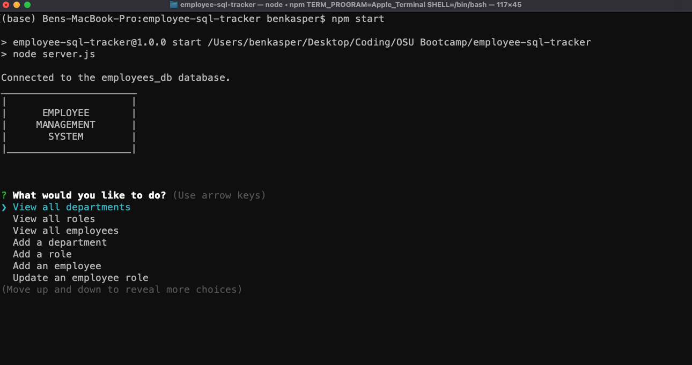

# employee-sql-tracker

This is a simple application that allows the user to track their employees, roles, salaries, and departments stored in a database using MySQL. Please see below for more detailed steps in how the user interacts with this application.

## Accessing the application
This code is run out of the terminal using MySQL. Below is a link to the demo video as well as the Github repo.

**URL to Application Demo:**  https://youtu.be/0go5v2oIUm4

**Github Repo:** https://github.com/bckasper/employee-sql-tracker

## Instructions for use
**Below is a detailed breakdown of how this application works:**

1. The user opens their terminal and navigates to the directory.

2. The user will need to have MySQL downloaded and will need to sign in. Once signed in, the user can SOURCE the schema and seeds file in the db folder on the directory.

3. With the database activated and data stored, the user can exit MySQL in their terminal and run the application. Be sure to have the following npm packages downloaded before beginning:
    - inquirer
    - console.table
    - mysql2
    - dotenv

4. Enter either node server.js or npm start to begin the application.

5. The user can now follow prompts in the terminal to do one of the following:
    - View all departments
    - View all roles
    - View all employees
    - Add a department
    - Add a role
    - Add an employee
    - Update an existing employee's role

6. Once the user has completed the tasks they wanted to do in the application, they can choose 'Quit' in the list of prompts to exit the application.

## Screenshots of employee tracker app
 

## Contributors
This was a solo project developed by me.

## Technology used in this application
1. This application primarily uses MySQL (https://www.mysql.com)

2. The API routing was created via Express.js (https://expressjs.com)